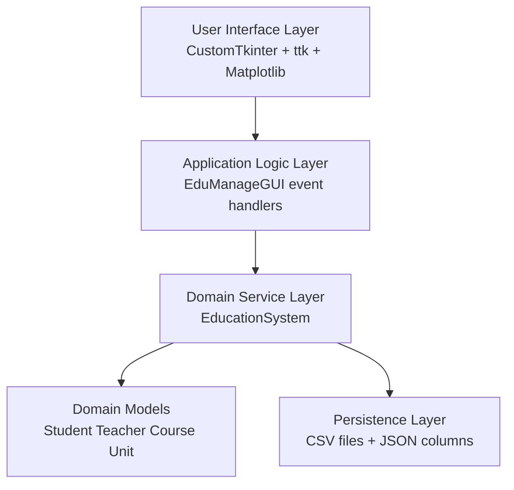
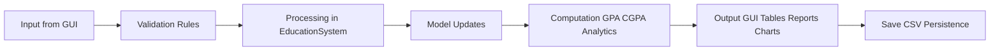

# EduManage Comprehensive System Report

## 1. Problem Description and Justification

Educational data management in many institutions is still fragmented across paper records, spreadsheet files, and disconnected processes. This causes several operational and academic risks:

- Duplicate and inconsistent records across students, courses, and teachers.
- Difficulty enforcing data integrity rules (valid email, unique IDs, valid enrollment chain).
- Weak traceability for unit-level progress and teacher workload.
- Slow transcript/report generation and limited decision-support analytics.
- High administrative overhead in update, verification, and audit processes.

EduManage is justified as a practical, maintainable desktop platform that centralizes operations and enforces business rules while preserving portability through file-based persistence.

## 2. Objectives of the System

The system is designed to achieve the following objectives:

1. Provide a single interface for managing students, courses, teachers, and enrollments.
2. Support unit-based academic structure under each course.
3. Enforce globally unique unit IDs and consistent teacher-course-unit mapping.
4. Record grades at unit level and compute weighted course GPA and cumulative CGPA.
5. Generate student reports and export official-looking PDF outputs.
6. Deliver actionable analytics for enrollment, grading, and teaching load.
7. Preserve records in transparent CSV storage with robust load/save behavior.
8. Improve reliability through comprehensive positive and negative automated tests.

## 3. System Design

### 3.1 Layered Architecture

### 3.2 Core Files and Responsibilities

- `gui_main.py`
- Builds and controls all GUI tabs.
- Validates user input at interaction level.
- Calls service-layer operations.
- Renders analytics charts.
- Generates report preview and styled PDF export.

- `system.py`
- Contains core business logic and rules.
- Handles CRUD operations and assignments.
- Computes report metrics and analytics.
- Persists and reconstructs data from CSV.

- `models.py`
- Defines `Person`, `Student`, `Teacher`, `Course`, and `Unit` models.
- Encapsulates enrollment and assignment behavior in model methods.

- `Data_Storage(CSV)`
- Stores students, courses, teachers, and unit-level enrollments.

- `tests/test_system.py`, `tests/test_system_negative.py`
- Verify valid workflows and invalid/error scenarios.

### 3.3 High-Level Operational Flow

## 4. Implementation Details

### 4.1 Technology and Libraries

- Python: application logic and data handling.
- CustomTkinter/tkinter/ttk: desktop GUI and tabular views.
- Matplotlib: embedded analytics visualization.
- ReportLab: branded and styled PDF report generation.
- Pytest: automated functional and validation testing.

### 4.2 Data Model and Relationships

- Person
- Base identity abstraction with `person_id`, `name`, and validated `email`.

- Student (inherits Person)
- Keeps `enrolled_courses` dictionary.
- Supports course enrollment, unit enrollment, and unit-grade assignment.

- Teacher (inherits Person)
- Stores `department`, `assigned_courses`, and `taught_units` mappings.

- Course
- Stores `course_id`, `name`, `credits`, `teacher_id`, `teacher_ids`, and `units`.
- Units are dictionaries with `unit_id`, `name`, `credits`, optional `teacher_id`.

- Unit
- Lightweight structure for unit identity and credit metadata.

### 4.3 Business Rules and Validation

Implemented constraints include:

- Unique student/course/teacher IDs.
- Global uniqueness for `unit_id` across all courses.
- Email format validation.
- Existence checks before assignment/enrollment/grading operations.
- Unit enrollment required before unit grade assignment.
- Cascade cleanup on delete operations (course/teacher/unit/enrollment).

### 4.4 Persistence Design

- `students_data.csv`: Student basic records.
- `courses_data.csv`: Course metadata, teacher links, and unit JSON.
- `teachers_data.csv`: Teacher metadata.
- `enrollments_data.csv`: Unit-level enrollment rows with grade values.

At load time, the system:

1. Loads entities from CSV.
2. Parses embedded JSON columns (`TeacherIDs`, `Units`).
3. Re-links teacher-course associations.
4. Re-links teacher-unit assignments from unit-level metadata.
5. Reconstructs student unit enrollments and grades.

## 5. Full Feature and Functionality Catalogue

### 5.1 Global UI Features

- Light/Dark theme toggle with palette switching.
- Consistent button palette (primary/info/accent/success/warning/danger/neutral).
- Styled TreeView tables with readable fonts and row heights.
- Auto-generated ID field syncing for student/teacher/course/unit forms.

### 5.2 Students Tab

- Add student with validation.
- Update student details.
- Delete selected student.
- Search/filter student list.
- Selection-based form population.

### 5.3 Courses Tab

- Add course with credit metadata.
- Update/delete course.
- Dedicated units panel linked to selected course.
- Add unit with uniqueness checks.
- Update/delete unit from selected course.
- Manage Units dialog with full CRUD workflow.
- Unit-teacher display in course units table.

### 5.4 Teachers Tab

- Add/update/delete teacher records with department.
- Assign teacher to course.
- Assign teacher to specific course unit.
- Dynamic unit dropdown update based on selected course.
- Workload metadata maintained through `taught_units`.

### 5.5 Enrollment and Grades Tab

- Enroll student to a course-unit from selected lists.
- Multi-unit enrollment workflow for selected course units.
- Assign/update grade for selected enrollment.
- Unit-specific grade assignment path.
- Delete enrollment at unit level.
- Real-time enrollment table refresh.

### 5.6 Reports Tab

- Generate structured report preview for selected student.
- Calculate course GPA and overall CGPA using weighted points.
- Include course, unit, credits, grade, letter, points, and teacher.
- Styled PDF export with:
- Branded header and optional logo auto-detection.
- Color-coded table headers and alternating row backgrounds.
- Grade/letter badge coloring by performance band.
- Highlighted CGPA section.
- Signature blocks and footer with page number.
- Preview note explaining text preview vs styled PDF output.

### 5.7 Analysis Tab

- Four-panel analytics dashboard:
- Students per course.
- Grade distribution (letter buckets).
- Teacher workload.
- System statistics summary.
- Student-specific snapshot selection.
- Teacher-specific snapshot selection.
- Clear selection and refresh controls.

### 5.8 Export Utilities

- Export course summary report to CSV.
- Deterministic overwrite behavior for latest summary snapshot.

## 6. How the System Works (Input, Processing, Output)

### 6.1 Input

Input channels:

- Text fields (name, email, department, credits, grade).
- Dropdown selectors (student, course, unit, teacher).
- Tree selections (record targeting for update/delete).
- Action buttons (add/update/delete/assign/enroll/report/export).

### 6.2 Processing

The service flow in `EducationSystem` performs:

1. Identity and reference validation.
2. Rule checks (uniqueness, enrollment prerequisites).
3. Entity graph updates (students/courses/teachers/units/enrollments).
4. Grade-to-letter and grade-to-point mapping.
5. Weighted metric computation:
- Course GPA = sum(point * unit_credits) / sum(unit_credits)
- CGPA = sum(all course weighted points) / sum(all graded credits)
6. Analytics aggregation.
7. CSV persistence serialization.

### 6.3 Output

Output channels:

- Updated GUI tables and forms.
- Report preview text.
- Exported report PDF.
- Analytics plots and stats.
- Updated CSV storage files.

## 7. Testing and Evaluation

### 7.1 Test Strategy

Two complementary suites are used:

- `test_system.py` for valid end-to-end workflows.
- `test_system_negative.py` for invalid/error-path validation.

### 7.2 Executed Results

- Functional suite: 11 passed.
- Negative suite: 15 passed.
- Combined result: 26 passed.

### 7.3 Verified Functional Areas

- Entity lifecycle operations.
- Unit uniqueness constraints.
- Teacher assignment integrity.
- Enrollment and grade dependencies.
- GPA and CGPA correctness.
- Analytics metric consistency.
- Save/load round-trip integrity.
- Cascade cleanup correctness.

### 7.4 Evaluation Summary

Strengths:

- Strong consistency rules and robust error handling.
- Clear separation of concerns between GUI, logic, and models.
- Rich reporting and analytics output for operational decisions.
- Portable persistence format and deterministic load/save behavior.

Limitations:

- CSV storage is not optimized for multi-user concurrency.
- GUI-level interaction tests are not yet automated.

Recommendations:

1. Add GUI automation tests for critical user journeys.
2. Add coverage threshold checks in CI.
3. Add migration path to SQLite/PostgreSQL for scale.
4. Add role-based authentication if deployed in shared environments.

## 8. Conclusion

EduManage provides a complete education-management workflow from master-data setup to academic outcome reporting. The system successfully combines usability, rule-driven processing, analytics, and tested reliability, meeting the expected requirements for a professional coursework-level information system.
