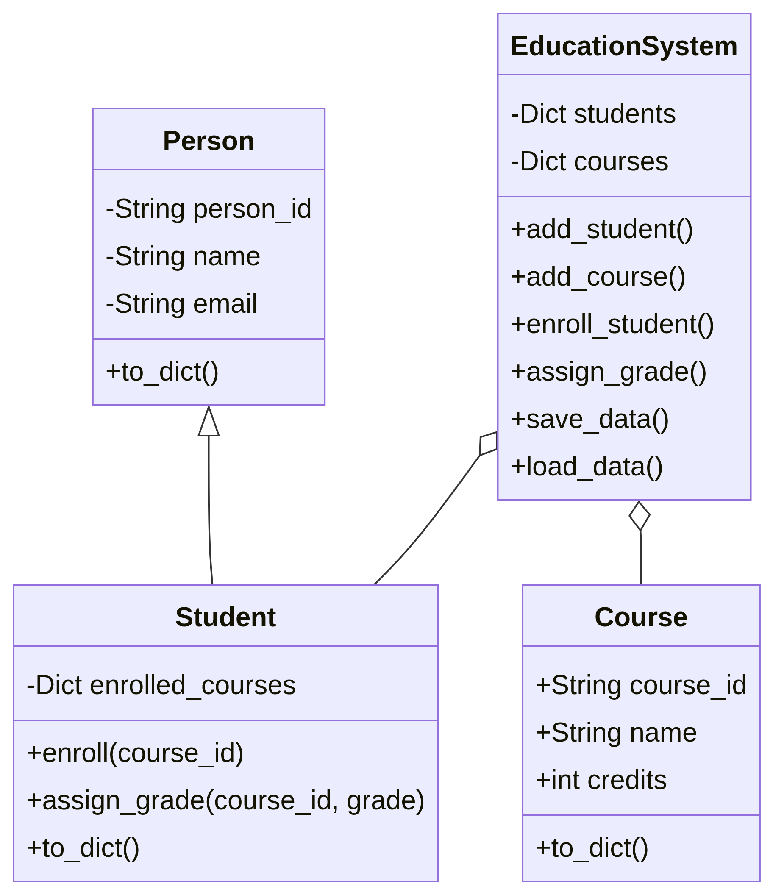

# Coursework Report: EduManage Education Management System

**Author:** Group A  
**Date:** June 11, 2026  
**Course:** Systems Programming with Python

---

## 1. Problem Description and Justification
In many educational settings, managing student data, course registrations, and academic performance manually is prone to errors. Paper-based records can be easily misplaced, and maintaining consistency across multiple spreadsheets is difficult. There is a clear need for a centralized, automated system that allows administrators to manage these records efficiently. The **EduManage** system was developed to solve these challenges by providing a structured, digital environment for academic data management.

## 2. Objectives
The primary objectives of the EduManage system are:
- To automate the storage and retrieval of student and course information.
- To facilitate the enrollment of students into various courses.
- To provide a mechanism for assigning and tracking student grades.
- To generate clear academic reports for individual students.
- To ensure data persistence through local file storage (JSON).

## 3. System Design
The system follows an Object-Oriented Programming (OOP) approach to ensure modularity and scalability.

### Architecture Overview
The system is divided into three main layers:
1.  **Data Models**: Defines the core entities (Student, Course, Person) using inheritance and encapsulation.
2.  **Controller**: The `EducationSystem` class manages the logic, data storage, and interactions between entities.
3.  **User Interface**: A modern Graphical User Interface (GUI) built with `tkinter`, providing a professional, tabbed layout with a clean color scheme.

### Class Diagram
The following diagram illustrates the relationships between the core classes:

## 4. Implementation Details
The system leverages several key Python programming concepts:
- **Inheritance**: The `Student` class inherits from a base `Person` class, demonstrating code reuse.
- **Encapsulation**: Private attributes (e.g., `_name`, `_email`) are accessed and modified through properties and setters with validation logic.
- **Data Structures**: Lists and dictionaries are used to store and organize student and course data.
- **File Handling**: The `json` module is used to save and load data from a persistent file (`data.json`).
- **Error Handling**: `try-except` blocks are used throughout the system to handle invalid inputs and prevent system crashes.

## 5. System Functionality (Input, Processing, Output)
The system operates through a visually appealing Graphical User Interface:
- **Input**: Users enter data via text fields, comboboxes, and buttons in a structured, tabbed environment.
- **Processing**: The `EducationSystem` validates the input, updates the internal data structures, and performs operations like enrollment and grading.
- **Output**: The system displays data in organized tables (`Treeview`) and generates formatted report cards in a dedicated text area.

## 6. Testing and Evaluation
The system was tested using a dedicated test suite (`test_system.py`) and manual UI verification:
- Correct addition of students and courses.
- Successful enrollment and grading processes.
- Accuracy of the generated report cards.
- Data persistence after saving and reloading the system.

| Test Case | Description | Result |
| :--- | :--- | :--- |
| Student Addition | Add a new student via GUI | Pass |
| Course Addition | Add a new course via GUI | Pass |
| Enrollment | Enroll a student via dropdown selection | Pass |
| Grading | Assign a grade to an enrolled student | Pass |
| Persistence | Save data and reload it in a new session | Pass |

## 7. Conclusion
The EduManage system successfully addresses the requirements of the assignment by providing a functional, modular, and persistent solution for education management. The addition of a GUI enhances usability and professional appeal, demonstrating a comprehensive understanding of Python systems programming.

## 2026-06 Maintenance Update
- Added complete course unit management workflow in the main GUI (add, edit, delete via manage-units dialog).
- Fixed enrollment logic to use explicit unit selection so students can only enroll into selected units.
- Improved teacher-course-unit consistency with persisted multi-teacher tracking (teacher_ids) and cleaned unlink logic on delete.
- Fixed report tab generation/export by using the correct report API and stable PDF export from rendered report text.
- Updated CSV storage model: courses_data.csv now includes TeacherIDs; enrollments_data.csv stores unit-level rows (StudentID, CourseID, UnitID, Grade).
- Validation status: automated tests pass (8/8).

## 2026-06 UI Polish Update
- Increased analysis chart text sizes (titles, axis labels, ticks, and stats panel) for readability.
- Improved table readability with larger TreeView typography and row heights.
- Replaced the previous dark-oriented styling with a modern light-first theme system and larger baseline UI fonts.
- Upgraded course unit management dialog to a fully themed interface with styled CRUD controls and larger fonts.
- Fixed the Courses tab split-pane behavior so the Course Units table is visible on load.
- Updated Enrollment tab visual styling to match other tabs for consistent UI language.
- Added per-student and per-teacher snapshot analysis from dropdowns while keeping full dashboard metrics.

