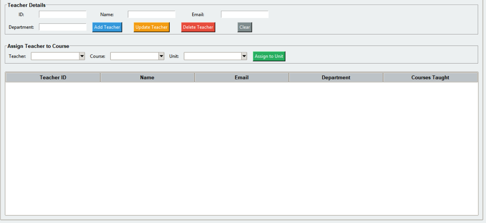

# EduManage Advanced Education Management System

## Overview
EduManage is an advanced education management system built with Python and Tkinter. It provides comprehensive management of students, courses, teachers, enrollments, grades, and detailed analytics with visualizations.

## System Features

### 1. **CSV-Based Data Storage**
- Replaced JSON with CSV format for better data management and scalability
- Separate CSV files for each data type:
  - `students_data.csv` - Student information
  - `courses_data.csv` - Course details with teacher assignments
  - `teachers_data.csv` - Teacher information and departments
  - `enrollments_data.csv` - Student-course enrollments and grades

### 1. **Teacher Management**
- Add, manage, and track teacher information
- Assign teachers to courses and specific course units
- Track teacher workload (number of units taught)
- Department assignment for organizational purposes
- View teacher details including assigned courses/units
- Teacher, course, student, and unit IDs are generated automatically




### 3. **Teacher-Course Assignment**
- Assign teachers to courses directly from the GUI
- Assign teachers to individual course units via unit dropdown
- Automatic tracking of taught units per teacher
- Display assigned teacher at both course and unit levels

### 3. **Course Unit Management**
- Add, update, and delete units per course
- Dedicated themed unit management dialog with full CRUD actions
- Inline units panel on Courses tab with selected-course context
- Unit IDs are generated automatically and validated for uniqueness and consistency

### 5. **Enhanced Reporting**
- Student reports now include assigned teacher information
- Comprehensive unit-level details with teacher names
- Grade tracking at unit level with GPA/CGPA output

### 6. **Analytics & Visualization Dashboard**
The new Analysis tab provides:
- **Students per Course**: Bar chart showing enrollment distribution
- **Grade Distribution**: Histogram of grades across all students
- **Teacher Workload**: Horizontal bar chart showing courses per teacher
- **System Statistics**: Overall metrics including:
  - Total number of students
  - Total number of courses
  - Total number of teachers
  - System-wide average grade

### 7. **UI/Theming Improvements**
- Modern light-first interface with polished accent palettes for a cleaner professional look
- Table header and row typography increased for readability
- Analysis chart label, title, and tick fonts enlarged
- Better spacing and compact header for improved data/table area

## 6. **Exporting Data**

## 📄 Export Report to PDF
  **Functionality**: Convert a generated student report card into a professional, publication-ready PDF document.
  
  **Professional PDF Features**:
  - Institutional header block with branded report title
  - Optional institution logo support (auto-detected when placed in images folder)
  - Student information displayed with clear labeled fields
  - Professional table layout with:
    - Color-coded column headers (navy background)
    - Alternating row colors for improved readability
    - Bordered cells for clear data organization
    - Course-level GPA display for each course
    - Grade and letter badge coloring by performance bands
  - Overall CGPA highlighted with secondary orange color
  - Signature lines for Prepared By, Verified By, and Registrar Signature
  - Fixed footer with page number and confidentiality note
  - Generated timestamp for audit trail
  - Proper spacing and typography for professional appearance
  
  **Technical Detail**: Uses the ReportLab library with professional styling including:
  - Color scheme: Primary navy (#0F4C81), Secondary coral (#F28C6F)
  - Centralized PDF palette configuration in code for easy school-brand customization
  - Light backgrounds and dark text for readability
  - Bordered table cells with alternating row fill colors
  - Clear section separations with visual hierarchy
  - Optimized layout for print and digital viewing with multi-page footer rendering

  **Preview vs Export Note**:
  - The in-app report area is a plain-text preview for speed and readability.
  - Full visual styling (branding, colors, grade badges, signature/footer blocks) appears in the exported PDF.
  - This separation is intentional because the GUI preview widget is text-only, while PDF export uses ReportLab layout primitives.

  **Logo Setup (Optional)**:
  - Add one of these files under `images/` to enable logo rendering in the PDF header:
    - `institution_logo.png`
    - `school_logo.png`
    - `logo.png`
  - If no logo file is found, the system falls back to the `EM` badge automatically.

## 📊 Export Course Summary to CSV
  Functionality: Generates a structured CSV file containing the full course overview and unit breakdown for easy analysis in spreadsheet software.

  Workflow: This function is optimized for maintenance. It operates in write mode ('w'), meaning it automatically overwrites the previous summary file each time it is used. This ensures you always maintain a single, "source-of-truth" file, preventing your project directory from being cluttered with outdated report versions.

## File Structure

```
Intermediate Education System in Python Based on PDF Guidelines/
├── gui_main.py                 # Main GUI application
├── system.py                   # Core system logic (CSV storage)
├── models.py                   # Data models (Student, Course, Teacher)
├── students_data.csv           # Student records
├── courses_data.csv            # Course records with teacher assignments
├── teachers_data.csv           # Teacher records
├── enrollments_data.csv        # Student enrollments and grades
└── README_ADVANCED.md          # This file
```

## Installation

### Requirements
```
tkinter              # Usually comes with Python
matplotlib           # For data visualization
```

### Install Dependencies
```bash
pip install matplotlib
```

### Run the Application
```bash
python gui_main.py
```

## User Guide

### Students Tab
- **Add Student**: Enter name and email to register new students; the student ID is generated automatically
- **View All**: List of all registered students

### Courses Tab
- **Add Course**: Enter name and credit hours; the course ID is generated automatically
- **View Assignments**: See which teacher is assigned to each course
- **Teacher Assignment**: Manage teacher assignments (via Teachers tab)

### Teachers Tab
- **Add Teacher**: Register teachers with ID, name, email, and department
- **Assign to Course**: Select a teacher and course to create teaching assignments
- **View Workload**: See all courses taught by each teacher

### Enrollment & Grades Tab
- **Enroll Student**: Select student and course to create enrollment
- **Assign Grade**: Enter grades (0-100) for enrolled students

### Reports Tab
- **Generate Report**: Select a student to view:
  - Professional report display with borders and emoji icons
  - Student name and ID with clear formatting
  - Enrolled courses with GPA per course
  - Credits for each course and unit
  - Assigned grades at unit level
  - **Assigned teacher for each course/unit** (NEW)
  - Overall CGPA prominently displayed
  - Report generation timestamp
  
- **Visual Enhancements**:
  - Unicode box borders for clean, professional appearance
  - Color-coded structure with visual hierarchy
  - Emoji icons (📋, 📌, 🔢, 📚, 🎯) for better readability
  - Organized table format with clear column headers
  
- **Export to PDF**: Generate publication-ready PDF with:
  - Professional color scheme (purple/blue headers, orange highlights)
  - Bordered table layout with alternating row colors
  - Clear section divisions
  - Institution branding
  - Timestamp for audit purposes

### Analysis Tab 
- **Refresh Charts**: Update all visualizations with current data
- **View Charts**:
  - Students per course distribution
  - Grade distribution across ranges
  - Teacher workload comparison
  - System statistics overview

## Data Storage Format

### CSV Structure

**students_data.csv**
```
StudentID,Name,Email
S001,John Doe,john@example.com
S002,Jane Smith,jane@example.com
```

**courses_data.csv**
```
CourseID,Name,Credits,TeacherID,TeacherIDs,Units
C001,Mathematics,3,T001,"[\"T001\"]","[{\"unit_id\":\"U1\",\"name\":\"Algebra\",\"credits\":1}]"
C002,English,3,T002,"[\"T002\"]","[{\"unit_id\":\"U1\",\"name\":\"Grammar\",\"credits\":1}]"
```

**teachers_data.csv**
```
TeacherID,Name,Email,Department
T001,Dr. Smith,smith@example.com,Science
T002,Prof. Johnson,johnson@example.com,Literature
```

**enrollments_data.csv**
```
StudentID,CourseID,UnitID,Grade
S001,C001,U1,85
S001,C002,U1,90
S002,C001,U1,75
```

## Key Classes

### Person (Base Class)
- `person_id`: Unique identifier
- `name`: Full name
- `email`: Email address with validation
- Properties: `person_id`, `name`, `email`

### Student (extends Person)
- `enrolled_courses`: Dictionary of course_id -> {units}
- Methods: `enroll()`, `enroll_unit()`, `assign_unit_grade()`

### Teacher (extends Person)
- `department`: Department name
- `assigned_courses`: List of course IDs
- `taught_units`: Dictionary of course_id -> [unit_ids]
- Methods: `assign_course()`, `assign_unit()`, `remove_unit()`

### Course
- `course_id`: Unique course identifier
- `name`: Course name
- `credits`: Credit hours
- `teacher_id`: Primary assigned teacher (can be None)
- `teacher_ids`: All linked teachers
- `units`: List of unit dictionaries

### EducationSystem (Main Controller)
- Manages all students, courses, and teachers
- Handles enrollments and grading
- Provides analytics and reporting
- CSV-based data persistence

## Analytics Methods

### get_analytics()
Returns dictionary with:
- `total_students`: Count of all students
- `total_courses`: Count of all courses
- `total_teachers`: Count of all teachers
- `avg_grade`: System-wide average grade
- `students_per_course`: Dictionary of course -> enrollment count
- `grades_distribution`: Distribution across grade ranges
- `teacher_workload`: Dictionary of teacher -> course count

## Features Comparison

| Feature | Basic | Advanced |
|---------|-------|----------|
| Student Management | ✓ | ✓ |
| Course Management | ✓ | ✓ |
| Enrollment & Grades | ✓ | ✓ |
| Reports | ✓ | ✓ + Teacher Info |
| Teacher Management | ✗ | ✓ |
| Teacher-Course Assignment | ✗ | ✓ |
| CSV Storage | ✗ | ✓ |
| Analytics Dashboard | ✗ | ✓ |
| Data Visualization | ✗ | ✓ |

## Error Handling

The system includes comprehensive error handling:
- Duplicate ID prevention
- Data validation for grades
- Exception handling for file I/O operations
- User-friendly error messages via message boxes

## Performance Considerations

- **CSV Files**: Efficient for moderate-sized datasets (100s-1000s of records)
- **In-Memory Storage**: All data loaded into memory for fast access
- **Real-Time Updates**: Data saved immediately after each operation
- **Scalability**: For larger datasets, consider database integration

## Future Enhancements

Potential features for future versions:
- Database integration (SQLite, PostgreSQL)
- User authentication and roles
- Attendance tracking
- Assignment and test management
- More advanced analytics (GPA calculations, trend analysis)
- Email notifications
- Multi-user concurrent access
- Backup and recovery system

## Troubleshooting

### Issue: matplotlib not found
**Solution**: Install matplotlib
```bash
pip install matplotlib
```

### Issue: CSV files not found
**Solution**: The system will create them automatically on first save

### Issue: GUI window not appearing
**Solution**: Ensure tkinter is installed (usually included with Python)

### Issue: Data not saving
**Solution**: Check file permissions in the directory

## License
This is an educational project for demonstration purposes.

## Support
For issues or questions, refer to the code comments and docstrings in:
- `system.py` - Core system logic
- `models.py` - Data model definitions
- `gui_main.py` - User interface implementation

## 2026-06 Maintenance Update
- Added complete course unit management workflow in the main GUI (add, edit, delete via manage-units dialog).
- Fixed enrollment logic to use explicit unit selection so students can only enroll into selected units.
- Improved teacher-course-unit consistency with persisted multi-teacher tracking (teacher_ids) and cleaned unlink logic on delete.
- Fixed report tab generation/export by using the correct report API and stable PDF export from rendered report text.
- Updated CSV storage model: courses_data.csv now includes TeacherIDs; enrollments_data.csv stores unit-level rows (StudentID, CourseID, UnitID, Grade).
- Validation status: automated tests pass (8/8).

## 2026-06 UI Polish Update
- Increased analysis chart text sizes (titles, axis labels, ticks, and stats panel) for readability.
- Improved table readability with larger TreeView typography and row heights.
- Replaced the previous dark-oriented styling with a modern light-first theme system and larger baseline UI fonts.
- Upgraded course unit management dialog to a fully themed interface with styled CRUD controls and larger fonts.
- Added a unified button style system (primary/info/success/warning/danger/neutral) and softer card spacing for a more cohesive modern interface.
- Fixed the Courses tab split layout so the Course Units table remains visible instead of collapsing below the fold.
- Updated Enrollment tab surface styling to match the visual language used in the other tabs.
- Extended Analysis with student and teacher snapshot views from dropdown selections while preserving full system analytics.

## 2026-06 Report Export Redesign Update
- Replaced the PDF export engine with ReportLab for robust styled PDF generation and improved compatibility.
- Fixed Unicode/codec export failures by removing fragile character-path dependencies in the PDF pipeline.
- Added an institutional header block, structured student info panel, bordered performance table, and highlighted CGPA section.
- Added grade/letter badge coloring in exported PDFs to improve visual interpretation of performance.
- Added signature lines and an official footer (confidentiality note + page number) for print-ready academic documents.

