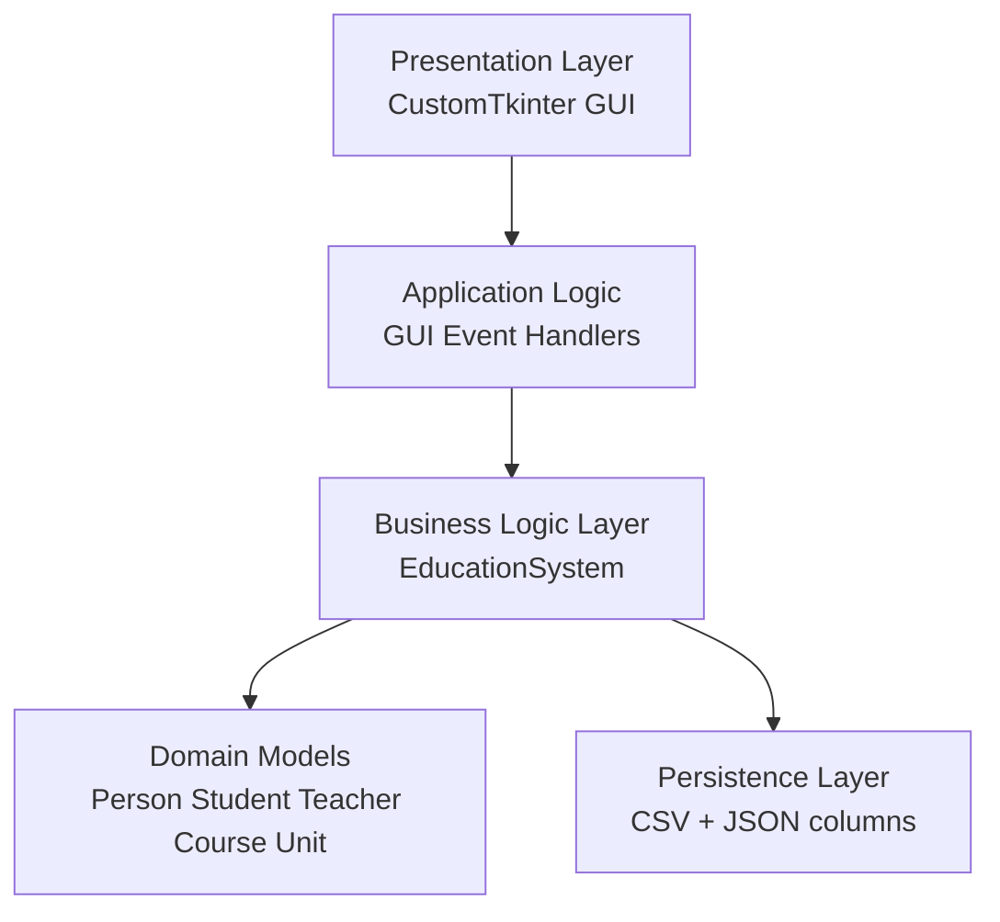
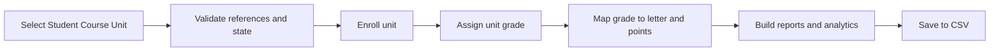
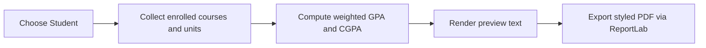

# EduManage System Report

## Abstract

EduManage is a desktop-based education management system developed to centralize and streamline academic administration. The system manages students, teachers, courses, units, enrollments, and grades while providing reporting and analytics capabilities. This report presents the problem context, project objectives, system architecture, implementation details, operational workflow, and testing/evaluation outcomes. The final system uses a layered design, CSV persistence, and a feature-complete graphical interface with validated business rules and automated test coverage.

## Chapter 1: Problem Description and Justification

### 1.1 Background

Educational organizations frequently rely on fragmented record-keeping methods such as spreadsheets, manual registers, and disconnected digital files. These practices increase operational risk and reduce administrative efficiency.

### 1.2 Problem Statement

The identified problems are:

- Record inconsistency across multiple data sources.
- Duplicate data entry and validation gaps.
- Difficulty in managing unit-level course progression.
- Limited visibility of teacher workload and grade distributions.
- Delayed transcript/report preparation and analytics reporting.

### 1.3 Justification

EduManage is justified as a centralized, maintainable, and practical desktop platform that:

- Enforces data integrity through business-rule validation.
- Provides end-to-end academic workflows in one interface.
- Supports professional report export and decision-support analytics.
- Preserves data in transparent, portable CSV format.

## Chapter 2: Objectives of the System

### 2.1 General Objective

Develop a reliable education-management information system that consolidates student, teacher, course, enrollment, and reporting workflows.

### 2.2 Specific Objectives

1. Implement full CRUD operations for core entities (students, courses, teachers).
2. Model unit-based course structures and enforce globally unique unit IDs.
3. Support teacher assignment at both course and unit levels.
4. Enable unit-level enrollment and grading workflows.
5. Compute weighted course GPA and overall CGPA automatically.
6. Provide polished report preview and professional PDF export.
7. Provide analytics for enrollment, grades, and workload.
8. Validate functionality using positive and negative automated test suites.

## Chapter 3: System Design

### 3.1 Architectural Overview

### 3.2 Design Rationale

The layered structure was selected to separate concerns:

- GUI handles interaction and presentation only.
- `EducationSystem` encapsulates business rules and operations.
- `models.py` captures domain entities and reusable behavior.
- CSV files provide persistent storage with simple portability.

### 3.3 Structural Components

- `gui_main.py`
- Theme handling, tab creation, form interaction, data display.
- Report generation triggers and PDF export integration.
- Matplotlib chart rendering for analytics.

- `system.py`
- Service-layer methods for all domain operations.
- Validation, assignment, enrollment, grading, analytics, persistence.

- `models.py`
- Class definitions and entity-level methods.

- `Data_Storage(CSV)`
- Runtime durable data files.

- `tests/`
- Automated system and negative-path verification.

### 3.4 Core Process Flows

#### 3.4.1 Enrollment and Grading Flow

#### 3.4.2 Reporting Flow

## Chapter 4: Implementation Details

### 4.1 Technology Stack

- Python: core implementation language.
- CustomTkinter/tkinter/ttk: UI components and table views.
- Matplotlib: embedded analytics charts.
- ReportLab: professional PDF export.
- Pytest: automated testing.
- CSV and JSON serialization: persistent data representation.

### 4.2 Domain Model Implementation

- `Person`
- Base class with `person_id`, `name`, `email`.
- Enforces email format via validation.

- `Student`
- Stores unit-level enrollment structure by course.
- Supports course and unit enrollment and grade assignment.

- `Teacher`
- Stores department, assigned courses, and taught unit mappings.

- `Course`
- Stores metadata plus `teacher_id`, `teacher_ids`, and `units` list.

- `Unit`
- Represents individual curriculum components with credits.

### 4.3 Service Layer (`EducationSystem`) Implementation

Implemented method groups include:

- ID generation and helper methods.
- CRUD operations for all core entities.
- Teacher assignment (`assign_teacher_to_course`, `assign_teacher_to_unit`).
- Enrollment and grading (`enroll_student_unit`, `assign_unit_grade`).
- Report generation (`get_student_report`).
- Analytics generation (`get_analytics` and helpers).
- Grade mapping (`grade_to_letter`, `grade_to_point`).
- CSV export utility (`export_courses_summary`).
- Persistence operations (`save_data`, `load_data`).

### 4.4 GUI Implementation

The interface is organized into six tabs:

1. Students
2. Courses
3. Teachers
4. Enrollment and Grades
5. Reports
6. Analysis

Major GUI capabilities:

- Theme toggle (light/dark) with full tab rebuild.
- Unified button style system with semantic variants.
- Course-unit management dialog with add/update/delete actions.
- Unit-level enrollment and grading controls.
- Report preview and PDF export integration.
- Real-time analytics refresh with optional entity snapshots.

### 4.5 Data Persistence and Reconstruction

Persistence model:

- Students, courses, teachers, and enrollments are written to CSV files.
- Course units and teacher ID lists are serialized as JSON inside CSV columns.
- On load, object graphs and links are reconstructed, including unit-teacher relationships and student unit-grade records.

## Chapter 5: System Functionality and Features

### 5.1 Student Features

- Create, read, update, delete students.
- Auto-ID support and email validation.
- Search/list display in tabular format.

### 5.2 Course and Unit Features

- Create, update, delete courses.
- Add, update, delete units under courses.
- Prevent duplicate unit IDs globally.
- Display selected course units and assigned teachers.

### 5.3 Teacher Features

- Create, update, delete teachers.
- Assign teacher to whole courses.
- Assign teacher to specific units.
- Track teacher workload from taught units.

### 5.4 Enrollment and Grading Features

- Enroll students at unit level.
- Assign and update grades by selected enrollment.
- Remove enrollment records safely.
- Enforce dependency checks before grade assignment.

### 5.5 Reporting Features

- Generate report preview with student, course, and unit details.
- Compute and show course GPA and overall CGPA.
- Export branded PDF with:
- Header branding and optional logo.
- Color-coded table style and grade badges.
- Signature lines and footer metadata.

### 5.6 Analytics Features

- Students per course chart.
- Grade distribution chart.
- Teacher workload chart.
- Summary statistics panel.
- Student/teacher snapshot controls.

## Chapter 6: How the System Works (Input, Processing, Output)

### 6.1 Input

Input sources include text fields, combo boxes, list selections, and action buttons.

### 6.2 Processing

Processing flow in `EducationSystem`:

1. Validate references and rule constraints.
2. Execute domain operation.
3. Update in-memory objects and relationships.
4. Compute derived values (letters, points, GPA, CGPA, analytics).
5. Persist or display results.

### 6.3 Output

Outputs include:

- Updated tables and forms.
- Report preview text.
- Styled PDF report file.
- Matplotlib charts and metrics.
- Persistent CSV state updates.

## Chapter 7: Testing and Evaluation

### 7.1 Testing Strategy

Two complementary suites were used:

- `test_system.py` for positive end-to-end workflows.
- `test_system_negative.py` for invalid/exception workflows.

### 7.2 Executed Test Results

- Functional suite: 11 passed.
- Negative suite: 15 passed.
- Total: 26 passed.

### 7.3 Evaluated Quality Dimensions

- Correctness of domain rules.
- Consistency of GPA/CGPA mathematics.
- Cascade behavior on delete operations.
- Persistence round-trip reliability.
- Robustness against invalid actions.

### 7.4 Limitations and Future Work

- CSV storage is suitable for desktop/single-user scope, but not ideal for concurrent multi-user scale.
- Security/authentication is not currently part of scope.
- Recommended improvements:
1. Transactional database backend.
2. GUI automation test layer.
3. CI-integrated coverage thresholds.
4. Role-based access and audit logs.

## Chapter 8: Conclusion

EduManage successfully fulfills the defined academic-management requirements through a layered architecture, robust service logic, feature-rich GUI workflows, professional reporting, and validated test outcomes. The system is maintainable, demonstrable, and extensible, with clear pathways for scaling and hardening in future iterations.
